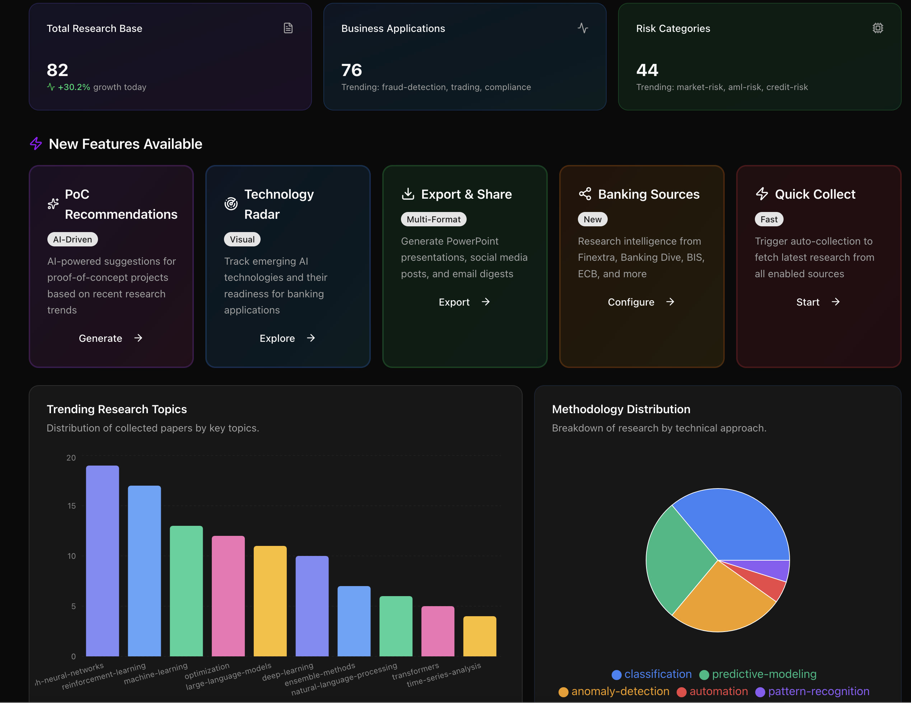
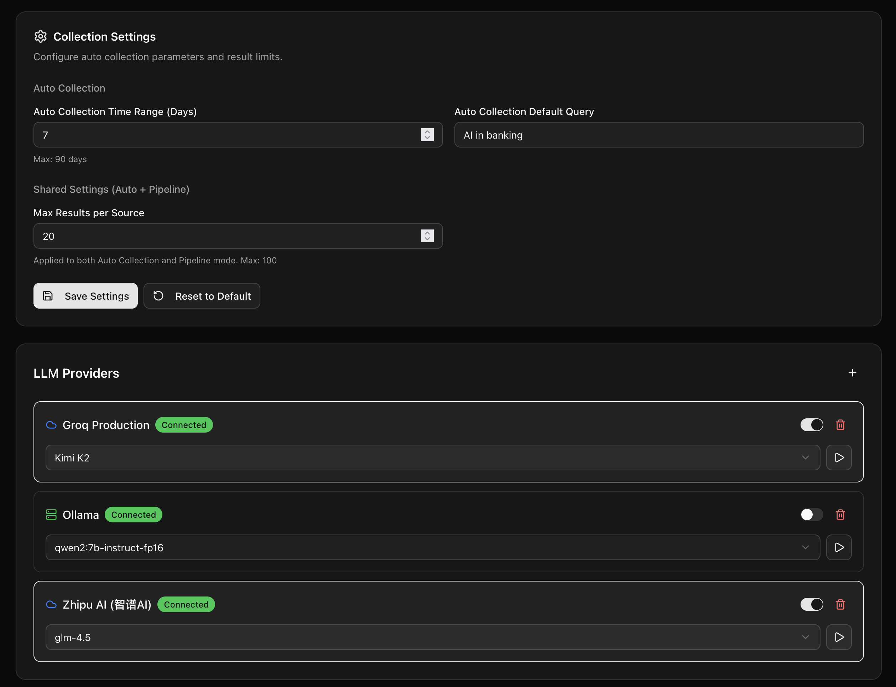
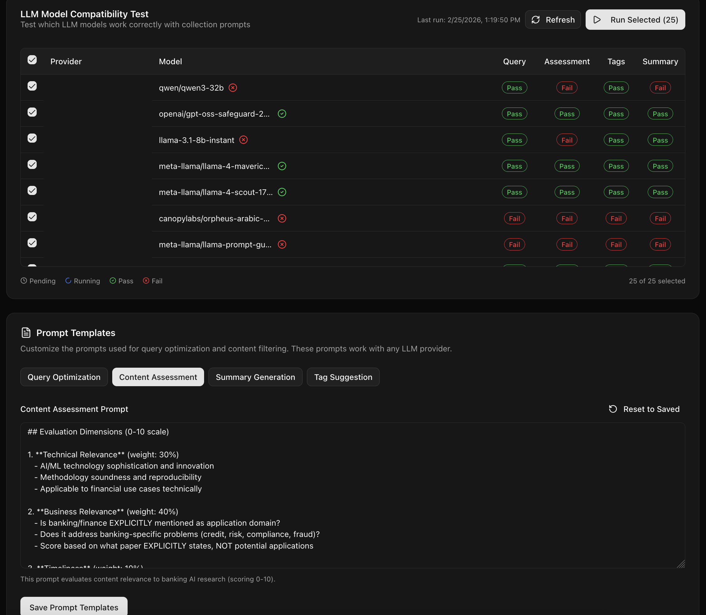

# InsightFlow

## AI-Powered Research Intelligence Platform

*A personal prototype demonstrating AI-augmented research workflows*

**Currently tuned for AI in Banking — designed to be domain-agnostic**

---

## Executive Summary

**InsightFlow** is an intelligent research management platform that helps teams discover, analyze, and act on relevant research more efficiently. What started as a personal project to practice innovation has evolved into a working prototype that demonstrates how AI can augment research workflows—reducing manual effort, accelerating insight generation, and centralizing knowledge.

---

## The Opportunity

Research workflows face common challenges: information overload, scattered knowledge, and time-consuming manual synthesis. InsightFlow explores how AI can address these challenges by automating discovery, intelligently filtering content, and generating actionable insights.

---

## Core Capabilities

### Working Features

| Feature | Description | Value |
|---------|-------------|-------|
| **Intelligent Collection** | Multi-source aggregation from ArXiv, Semantic Scholar, RSS feeds with AI-powered relevance filtering | Cut through noise, focus on what matters |
| **Technology Radar** | Thoughtworks-style quadrant view (Adopt/Trial/Assess/Hold) tracking technology maturity and relevance | Strategic view of emerging technologies |
| **Export Hub** | One-click generation of PowerPoint decks, email digests, and social media posts | Share insights professionally, instantly |
| **AI-Powered Analysis** | Real-time technical summaries, auto-tagging, and context-aware RAG chat with your paper library | Deep understanding without the manual effort |

### Potential Future Enhancements

| Feature | Vision |
|---------|--------|
| **Competitive Intelligence** | Track publications and patents from major financial institutions |
| **PoC Recommendations** | AI-generated proof-of-concept opportunities with effort estimates |
| **Regulatory Alerts** | Real-time monitoring from BIS, ECB, FCA, Federal Reserve |

---

## How It Works

### Collection Modes

| Mode | Description |
|------|-------------|
| **Auto** | Scheduled daily collection with configurable queries |
| **Manual** | User-initiated collection with custom parameters |
| **Pipeline** | Advanced mode with strict filtering for focused research |

### AI Augmentation Pipeline

```
┌─────────────┐    ┌─────────────┐    ┌─────────────┐    ┌─────────────┐    ┌─────────────┐
│   Query     │ →  │   Multi-    │ →  │   Content   │ →  │    Tag      │ →  │   Summary   │
│ Optimization│    │   Source    │    │ Assessment  │    │ Generation  │    │ Generation  │
│   (AI)      │    │   Search    │    │   (AI)      │    │   (AI)      │    │   (AI)      │
└─────────────┘    └─────────────┘    └─────────────┘    └─────────────┘    └─────────────┘
```

| Step | What AI Does | Impact |
|------|--------------|--------|
| **Query Optimization** | Transforms user query into domain-specific Boolean search with tech synonyms, relevant applications, and noise exclusions | Higher precision, less irrelevant results |
| **Content Assessment** | 4-dimensional scoring: Technical depth, Business relevance, Timeliness, Practicality | Only high-quality papers retained with transparent rationale |
| **Tag Generation** | Generates taxonomy-based tags from categories: AI technology, Business area, Risk domain, Methodology | Powers downstream analytics and navigation |
| **Summary Generation** | Fact-based technical summaries—only what's explicitly stated in the paper | Quick understanding without reading full abstract |

### Examples

**Query Optimization**
```
Input: "explainable AI"

Output (3-AND Boolean query):
("explainable AI" OR "XAI" OR "interpretability" OR "model transparency")
AND ("credit risk" OR "lending" OR "loan approval" OR "risk assessment")
AND ("banking" OR "financial")
NOT ("medical" OR "healthcare" OR "autonomous vehicle")
```

**Content Assessment**
```
Paper: "Unlocking the Black Box: A Five-Dimensional Framework
        for Evaluating Explainable AI in Credit Risk"

Scores:
  Technical:    8/10
  Business:     10/10
  Timeliness:   9/10
  Practicality: 8/10
  ─────────────────
  Final:        8.9/10 → Included ✓
```

**Auto-Generated Tags**
```
AI Technology:  explainable-ai, neural-networks
Business Area:  model-governance
Risk Category:  credit-risk
Methodology:    predictive-modeling
```

### Downstream Impact

AI-generated metadata flows through to power intelligent features:

| Source | Powers |
|--------|--------|
| **Tags** | Dashboard topic charts, Technology Radar categorization, Paper filtering & search |
| **Scores** | Technology Radar maturity/relevance calculations, Quality thresholds |
| **Summaries** | Paper cards, Export outputs (PPT, digests), Future: RAG chat context |
| **Assessment** | Transparency on why papers are included, Future: PoC recommendations |

---

## Screenshots

### Dashboard Overview

*Stats cards, topic distribution (powered by tags), methodology breakdown*

### Paper Library

*Search, filters, AI-generated summaries, assessment scores, tags*

### Paper Detail

*Individual paper view with AI summary, assessment scores, and auto-generated tags*

### Technology Radar


*Quadrant view powered by aggregated tags and scores, with maturity/relevance indicators*

### Collection Pipeline

*Agent-driven collection with real-time logs showing each AI augmentation step*

### Export Hub


*One-click PowerPoint, email digest, and social media exports*

### Settings


*Configure LLM providers, test model compatibility, and customize AI prompts*

---

## Technical Overview

| Aspect | Implementation |
|--------|----------------|
| **Framework** | Next.js with TypeScript |
| **AI/LLM** | Multi-LLM support with automatic fallback |
| **Database** | Prisma ORM with SQLite |
| **UI** | React with Tailwind CSS |

---

## Getting Started

### Requirements
- Node.js 18+
- A [Groq API Key](https://console.groq.com/) for AI features

### Installation

```bash
git clone https://github.com/AIScorpio/research-copilot.git
cd research-copilot
npm install
```

### Environment Configuration

Create a `.env` file in the root directory:

```env
DATABASE_URL="file:./dev.db"
LLM_PROVIDER="groq"
GROQ_API_KEY="your_groq_key_here"
```

### Database Setup

```bash
npx prisma db push
npx prisma generate
```

### Start Application

```bash
npm run dev
```

---

## Implementation Status

| Status | Features |
|--------|----------|
| **Working** | Intelligent Collection (Auto/Manual/Pipeline modes), AI Augmentation (Query/Assessment/Tags/Summary), Technology Radar, Export Hub, RAG Chat |
| **Planned** | Competitive Intelligence, PoC Recommendations, Regulatory Alerts |

---

## Security Considerations

Designed with enterprise security in mind:
- OAuth 2.0 authentication with local data storage
- Audit logging and user-specific configurations

---

<div align="center">

*Feb. 2026*

*Built to explore AI-augmented research workflows*

</div>
