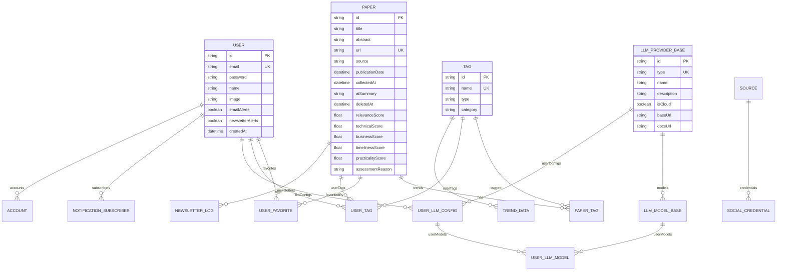

# InsightFlow Database Schema Documentation

**版本**: v1.0  
**日期**: 2026-02-16  
**数据库**: SQLite (通过Prisma ORM)  
**状态**: 当前生产环境Schema

---

## 目录

1. [Schema概览](#1-schema概览)
2. [核心表结构](#2-核心表结构)
3. [用户与认证](#3-用户与认证)
4. [论文与标签](#4-论文与标签)
5. [LLM提供商管理](#5-llm提供商管理)
6. [数据源与趋势](#6-数据源与趋势)
7. [索引优化](#7-索引优化)

---

## 1. Schema概览

### ER图（Mermaid）



### 表统计

| 表名 | 用途 | 预估数据量 |
|------|------|-----------|
| User | 用户账户 | 10-100 |
| Paper | 学术论文 | 1,000-10,000 |
| Tag | 标签定义 | 50-200 |
| PaperTag | 论文-标签关联 | 5,000-50,000 |
| LLMProviderBase | LLM提供商定义 | 5-10 |
| LLMModelBase | LLM模型定义 | 20-50 |
| UserLLMConfig | 用户LLM配置 | 10-50 |
| TrendData | 标签趋势数据 | 1,000-10,000 |

---

## 2. 核心表结构

### 2.1 Paper（论文表）

```prisma
model Paper {
  id                String          @id @default(uuid())
  title             String
  abstract          String?
  url               String          @unique
  source            String
  publicationDate   DateTime
  collectedAt       DateTime        @default(now())
  aiSummary         String?
  deletedAt         DateTime?
  
  // Relevance Scoring (1-10 scale)
  relevanceScore    Float?          // Total relevance (0-10)
  technicalScore    Float?          // Technical relevance (0-10)
  businessScore     Float?          // Business relevance (0-10)
  timelinessScore   Float?          // Timeliness (0-10)
  practicalityScore Float?          // Practicality (0-10)
  assessmentReason  String?         // LLM reasoning
  
  // Relations
  tags              PaperTag[]
  favoritedBy       UserFavorite[]
  userTags          UserTag[]
  newsletters       NewsletterLog[] @relation("NewsletterLogToPaper")
  
  // Indexes
  @@index([publicationDate])
  @@index([source])
  @@index([url])
  @@index([collectedAt])
  @@index([deletedAt])
  @@index([title])
  @@index([source, publicationDate], map: "Paper_source_date_idx")
}
```

**关键字段说明**:
- `relevanceScore`: 综合相关性评分（1-10分）
- `technicalScore`: 技术深度评分
- `businessScore`: 业务价值评分
- `timelinessScore`: 时效性评分
- `practicalityScore`: 实用性评分
- `assessmentReason`: LLM评估理由

### 2.2 Tag（标签表）

```prisma
model Tag {
  id        String      @id @default(uuid())
  name      String      @unique
  type      String
  category  String?
  papers    PaperTag[]
  trendData TrendData[]
  userTags  UserTag[]
}
```

**标签类型** (type字段):
- `Academic`: 学术类型（如：Deep Learning, NLP）
- `Industrial`: 工业类型（如：Risk, Fraud Detection）
- `User Defined`: 用户自定义
- `Technology`: 技术类别
- `Risk`: 风险相关
- `Business`: 业务相关

---

## 3. 用户与认证

### 3.1 User（用户表）

```prisma
model User {
  id               String                   @id @default(uuid())
  email            String                   @unique
  password         String
  name             String?
  image            String?
  emailAlerts      Boolean                  @default(false)
  newsletterAlerts Boolean                  @default(false)
  createdAt        DateTime                 @default(now())
  
  // Relations
  subscribers      NotificationSubscriber[]
  favorites        UserFavorite[]
  tags             UserTag[]
  accounts         Account[]
  llmConfigs       UserLLMConfig[]
}
```

### 3.2 Account（OAuth账户）

```prisma
model Account {
  id                String  @id @default(uuid())
  userId            String
  type              String
  provider          String
  providerAccountId String
  refresh_token     String?
  access_token      String?
  expires_at        Int?
  token_type        String?
  scope             String?
  id_token          String?
  session_state     String?
  
  user              User    @relation(fields: [userId], references: [id], onDelete: Cascade)
  
  @@unique([provider, providerAccountId])
  @@index([userId])
}
```

---

## 4. 论文与标签关联

### 4.1 PaperTag（论文-标签关联表）

```prisma
model PaperTag {
  paperId String
  tagId   String
  paper   Paper  @relation(fields: [paperId], references: [id])
  tag     Tag    @relation(fields: [tagId], references: [id])
  
  @@id([paperId, tagId])
  @@index([paperId])
  @@index([tagId])
}
```

**说明**: 多对多关联表，一篇论文可以有多个标签，一个标签可以关联多篇论文。

### 4.2 UserFavorite（用户收藏）

```prisma
model UserFavorite {
  userId  String
  paperId String
  user    User   @relation(fields: [userId], references: [id])
  paper   Paper  @relation(fields: [paperId], references: [id])
  
  @@id([userId, paperId])
}
```

### 4.3 UserTag（用户自定义标签）

```prisma
model UserTag {
  id      String @id @default(uuid())
  userId  String
  paperId String
  tagId   String
  user    User   @relation(fields: [userId], references: [id])
  paper   Paper  @relation(fields: [paperId], references: [id])
  tag     Tag    @relation(fields: [tagId], references: [id])
  
  @@index([paperId])
}
```

---

## 5. LLM提供商管理

### 5.1 LLMProviderBase（LLM提供商定义）

```prisma
model LLMProviderBase {
  id          String   @id @default(uuid())
  type        String   @unique // groq, openai, anthropic, ollama, lmstudio, gemini, azure, cohere
  name        String   // Display name
  description String?
  isCloud     Boolean  @default(true)
  baseUrl     String?  // Default base URL for local providers
  docsUrl     String?  // Documentation URL
  createdAt   DateTime @default(now())
  updatedAt   DateTime @updatedAt
  
  // Relations
  models      LLMModelBase[]
  userConfigs UserLLMConfig[]
  
  @@index([type])
  @@index([isCloud])
}
```

**支持的提供商类型**:
- `groq`: Groq Cloud (超高速推理)
- `openai`: OpenAI API
- `anthropic`: Anthropic Claude
- `ollama`: Ollama (本地部署)
- `lmstudio`: LM Studio (本地)
- `gemini`: Google Gemini
- `azure`: Azure OpenAI
- `cohere`: Cohere API

### 5.2 LLMModelBase（LLM模型定义）

```prisma
model LLMModelBase {
  id            String   @id @default(uuid())
  providerId    String
  externalId    String   // Provider's model ID (e.g., "gpt-4", "llama-3.3-70b")
  name          String   // Display name
  description   String?
  contextWindow Int?     // Context window size
  capabilities  String   // JSON array: ["chat", "vision", "embedding"]
  isActive      Boolean  @default(true)
  createdAt     DateTime @default(now())
  updatedAt     DateTime @updatedAt
  
  // Relations
  provider     LLMProviderBase @relation(fields: [providerId], references: [id], onDelete: Cascade)
  userModels   UserLLMModel[]
  
  @@unique([providerId, externalId])
  @@index([providerId])
  @@index([isActive])
}
```

### 5.3 UserLLMConfig（用户LLM配置）

```prisma
model UserLLMConfig {
  id           String    @id @default(uuid())
  userId       String
  providerId   String
  name         String    // User-defined name (e.g., "My Groq Account")
  apiKey       String?   // Encrypted API key for cloud providers
  baseUrl      String?   // Custom base URL
  status       String    @default("untested") // untested, connected, failed
  errorMessage String?   // Last error message if failed
  priority     Int       @default(0) // Fallback priority (0 = highest)
  isEnabled    Boolean   @default(false)
  createdAt    DateTime  @default(now())
  updatedAt    DateTime  @updatedAt
  deletedAt    DateTime? // Soft delete
  
  // Relations
  user         User              @relation(fields: [userId], references: [id], onDelete: Cascade)
  provider     LLMProviderBase   @relation(fields: [providerId], references: [id])
  userModels   UserLLMModel[]
  
  @@unique([userId, providerId, name])
  @@index([userId])
  @@index([status])
  @@index([priority])
  @@index([isEnabled])
}
```

### 5.4 UserLLMModel（用户启用的模型）

```prisma
model UserLLMModel {
  id            String   @id @default(uuid())
  userConfigId  String
  modelId       String
  isDefault     Boolean  @default(false)
  temperature   Float?
  maxTokens     Int?
  createdAt     DateTime @default(now())
  updatedAt     DateTime @updatedAt
  
  // Relations
  userConfig UserLLMConfig @relation(fields: [userConfigId], references: [id], onDelete: Cascade)
  model      LLMModelBase  @relation(fields: [modelId], references: [id])
  
  @@unique([userConfigId, modelId])
}
```

---

## 6. 数据源与趋势

### 6.1 Source（数据源定义）

```prisma
model Source {
  id                String             @id @default(uuid())
  name              String             @unique
  url               String
  type              String             @default("academic")
  enabled           Boolean            @default(true)
  requiresAuth      Boolean            @default(false)
  authConfig        String?
  createdAt         DateTime           @default(now())
  socialCredentials SocialCredential[]
  
  @@index([type])
}
```

**数据源类型**:
- `academic`: 学术数据库（ArXiv, SSRN, IEEE, ACM）
- `news`: 新闻源（Banking News, Financial Times）
- `regulatory`: 监管机构（BIS, ECB, FCA）
- `social`: 社交媒体（Reddit, LinkedIn）

### 6.2 TrendData（标签趋势数据）

```prisma
model TrendData {
  id        String   @id @default(uuid())
  tagId     String
  date      DateTime
  count     Int
  createdAt DateTime @default(now())
  tag       Tag      @relation(fields: [tagId], references: [id])
  
  @@unique([tagId, date])
  @@index([date])
  @@index([tagId, date])
}
```

**说明**: 存储每个标签在不同日期的论文数量，用于绘制趋势图。

---

## 7. 索引优化

### 7.1 已配置的索引

| 表名 | 索引字段 | 用途 |
|------|---------|------|
| Paper | publicationDate | 按日期筛选论文 |
| Paper | source | 按数据源筛选 |
| Paper | url | URL去重检查 |
| Paper | collectedAt | 按收集时间排序 |
| Paper | title | 标题搜索 |
| Paper | source + publicationDate | 联合查询优化 |
| Tag | name | 标签名称唯一性 |
| TrendData | tagId + date | 趋势查询 |
| UserLLMConfig | userId + providerId | 用户配置查询 |
| Account | provider + providerAccountId | OAuth唯一性 |

### 7.2 查询优化建议

**高频查询场景**:
```sql
-- 按日期范围查询论文（Technology Radar核心查询）
SELECT * FROM Paper 
WHERE publicationDate >= ? 
ORDER BY publicationDate DESC;

-- 按标签查询论文
SELECT p.* FROM Paper p
JOIN PaperTag pt ON p.id = pt.paperId
WHERE pt.tagId = ?;

-- 查询用户的LLM配置
SELECT * FROM UserLLMConfig 
WHERE userId = ? AND isEnabled = true 
ORDER BY priority ASC;
```

---

## 8. 数据备份与恢复

### 8.1 备份策略

```bash
# SQLite数据库备份
cp prisma/dev.db backups/dev_$(date +%Y%m%d_%H%M%S).db

# 导出为SQL
sqlite3 prisma/dev.db .dump > backups/dev_$(date +%Y%m%d_%H%M%S).sql
```

### 8.2 关键数据表

**不可丢失**:
- `Paper`: 核心论文数据
- `Tag`: 标签定义
- `PaperTag`: 论文-标签关联
- `User`: 用户账户
- `UserLLMConfig`: 用户LLM配置

**可重建**:
- `TrendData`: 可从Paper重新计算
- `NewsletterLog`: 日志数据

---

## 附录

### A. 完整Prisma Schema文件位置

`/Users/leon/Documents/04.Agents/01.Researcher/prisma/schema.prisma`

### B. 数据库迁移命令

```bash
# 生成迁移
npx prisma migrate dev --name add_tech_history

# 应用迁移
npx prisma migrate deploy

# 生成客户端
npx prisma generate

# 查看数据库
npx prisma studio
```

### C. 数据字典

**Paper.relevanceScore计算公式**:
```
relevanceScore = technicalScore * 0.3 + businessScore * 0.4 + timelinessScore * 0.1 + practicalityScore * 0.2
```

**象限判定**（在应用层计算，非数据库字段）:
```
ADOPT: 成熟度≥70 且 相关性≥70
TRIAL: 成熟度≥50 且 相关性≥50
ASSESS: 成熟度≥30
HOLD: 其他
```

---

**文档结束**

**更新记录**:
- v1.0 (2026-02-16): 初始版本，基于当前生产环境schema
