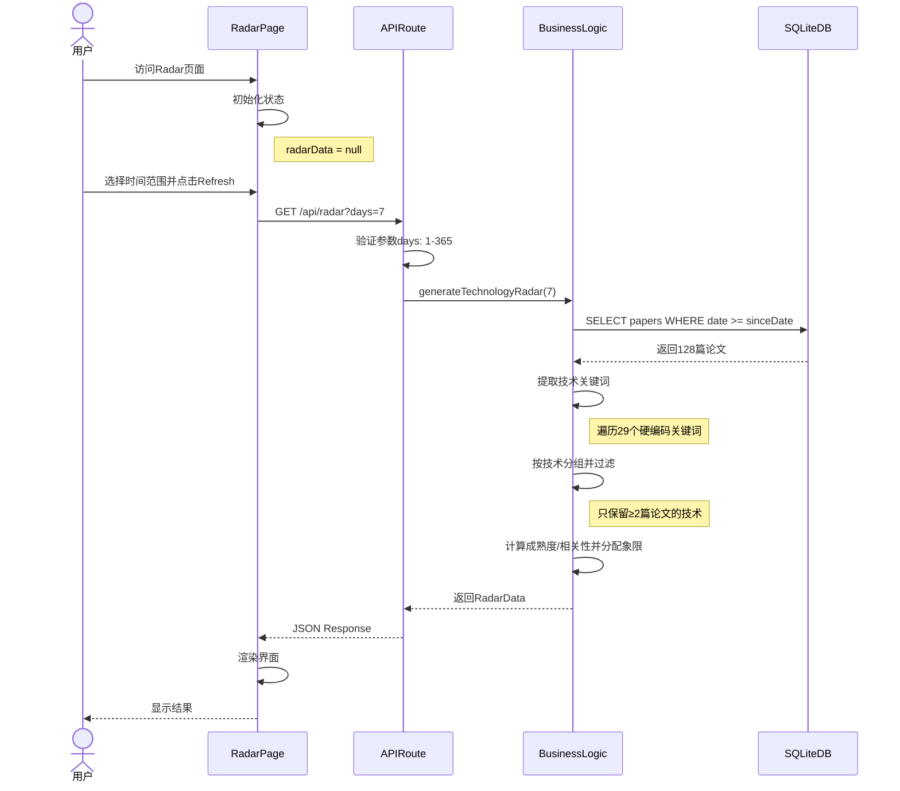
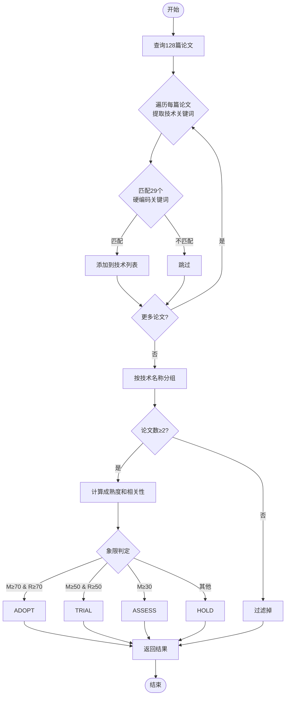
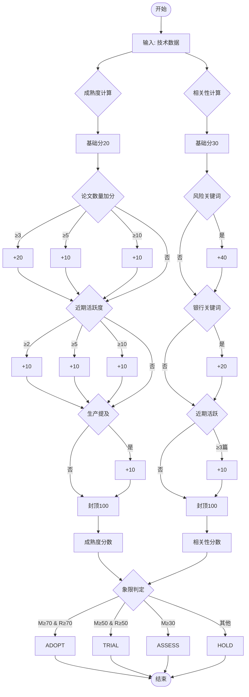
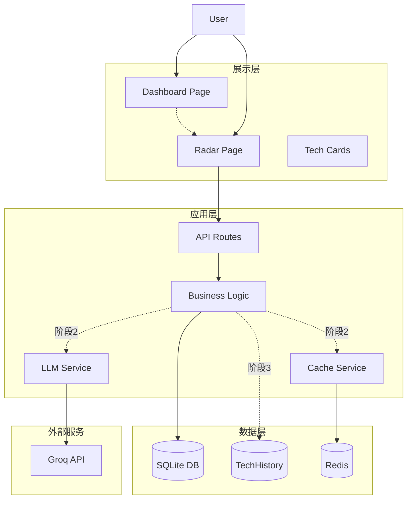
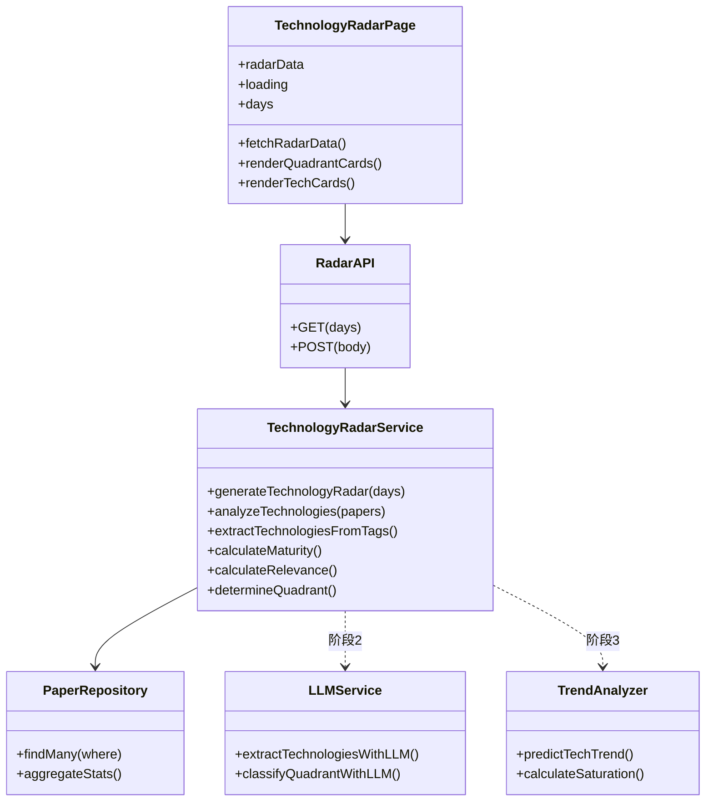

# Technology Radar 优化设计文档

**版本**: v2.2  
**日期**: 2026-02-16  
**作者**: InsightFlow Development Team  
**状态**: 待 Review  
**更新**: 添加阶段1双重对比方案、三阶段演进策略与一致性架构

---

## 1. 当前系统基础逻辑

### 1.1 核心数据流（Mermaid时序图）



---

### 1.2 技术关键词提取机制

#### 提取函数
```typescript
function extractTechnologiesFromTags(tags: string[], title: string, abstract: string | null): string[] {
    const allText = `${title} ${abstract || ''} ${tags.join(' ')}`.toLowerCase();
    const technologies: string[] = [];

    const techKeywords = [
        'deep learning', 'neural network', 'llm', 'language model',
        'graph neural network', 'knowledge graph', 'graph analytics',
        'nlp', 'natural language', 'text analysis',
        'computer vision', 'image recognition',
        'time series', 'forecasting', 'prediction',
        'anomaly detection', 'fraud detection',
        'reinforcement learning', 'agent',
        'credit scoring', 'credit risk',
        'regtech', 'suptech',
        'quantum', 'blockchain', 'cryptocurrency',
        'generative ai', 'chatgpt', 'gpt'
    ];

    for (const tech of techKeywords) {
        if (allText.includes(tech)) {
            technologies.push(capitalizeWords(tech));
        }
    }

    return [...new Set(technologies)];
}
```

#### 提取逻辑说明
1. **数据源**: 标题 + 摘要 + 标签（全部转小写）
2. **匹配方式**: 简单字符串包含检查
3. **关键词数量**: **29个预定义技术关键词**（硬编码）
4. **去重处理**: 同一篇论文中多次出现的技术只计一次
5. **大小写不敏感**: 所有文本统一转小写后匹配

---

### 1.2 论文到技术的聚合逻辑（Mermaid流程图）



---

### 1.3 技术维度计算逻辑

#### 成熟度计算
```typescript
function calculateMaturity(allPapers: any[], recentPapers: any[]): number {
    let score = 20; // 基础分

    if (allPapers.length >= 3) score += 20;
    if (allPapers.length >= 5) score += 10;
    if (allPapers.length >= 10) score += 10;

    if (recentPapers.length >= 2) score += 10;
    if (recentPapers.length >= 5) score += 10;
    if (recentPapers.length >= 10) score += 10;

    const mentionsInProduction = allPapers.some((p: any) => {
        const text = `${p.title} ${p.abstract || ''}`.toLowerCase();
        return text.includes('production') || 
               text.includes('implemented') || 
               text.includes('deployed');
    });
    if (mentionsInProduction) score += 10;

    return Math.min(score, 100);
}
```

#### 相关性计算
```typescript
function calculateRelevance(papers: any[]): number {
    let score = 30; // 基础分

    const riskRelatedKeywords = ['risk', 'compliance', 'fraud', 'aml', 'regulatory', 'security'];
    const hasRiskRelevance = papers.some((p: any) => {
        const text = `${p.title} ${p.abstract || ''}`.toLowerCase();
        return riskRelatedKeywords.some(kw => text.includes(kw));
    });
    if (hasRiskRelevance) score += 40;

    const bankingKeywords = ['banking', 'finance', 'fintech', 'financial'];
    const hasBankingRelevance = papers.some((p: any) => {
        const text = `${p.title} ${p.abstract || ''}`.toLowerCase();
        return bankingKeywords.some(kw => text.includes(kw));
    });
    if (hasBankingRelevance) score += 20;

    const recentActivity = papers.filter((p: any) => {
        const daysSince = (Date.now() - new Date(p.publicationDate).getTime()) / (1000 * 60 * 60 * 24);
        return daysSince < 60;
    });
    if (recentActivity.length >= 3) score += 10;

    return Math.min(score, 100);
}
```

#### 象限判定流程（Mermaid流程图）



**判定矩阵**:
```
              相关性低(<50)    相关性中(50-70)    相关性高(≥70)
             ┌─────────────┬─────────────┬─────────────┐
成熟度高(≥70) │    ASSESS   │    TRIAL    │    ADOPT    │
             ├─────────────┼─────────────┼─────────────┤
成熟度中(50-70)│    ASSESS   │    TRIAL    │    TRIAL    │
             ├─────────────┼─────────────┼─────────────┤
成熟度低(30-50)│    HOLD     │    ASSESS   │    ASSESS   │
             ├─────────────┼─────────────┼─────────────┤
成熟度极低(<30)│    HOLD     │    HOLD     │    HOLD     │
             └─────────────┴─────────────┴─────────────┘
```

---

### 1.4 Bank Adoption 计算逻辑

```typescript
function inferBankAdoption(papers: any[], _techName: string): string[] {
    const mentions: string[] = [];

    const bankPatterns = [
        /jpmorgan|j.p. morgan/gi,
        /goldman sachs/gi,
        /morgan stanley/gi,
        /barclays/gi,
        /hsbc/gi,
        /citigroup/gi,
        /bank of america/gi
    ];

    for (const paper of papers) {
        const text = `${paper.title} ${paper.abstract || ''}`;
        
        for (const pattern of bankPatterns) {
            const match = text.match(pattern);
            if (match) {
                const bankName = match[0].trim();
                if (!mentions.includes(bankName)) {
                    mentions.push(bankName);
                }
            }
        }
    }

    if (mentions.length === 0) {
        return ['Industry Research'];
    }

    return mentions.slice(0, 3);
}
```

---

### 1.5 数量关系

**数据流**:
```
论文总数 (N) 
    ↓ 提取技术关键词
匹配到的不同技术数 (M, M ≤ 29)
    ↓ 按技术分组 + 过滤（≥2篇）
最终显示的技术数 (K, K ≤ M)
    ↓ 计算象限
四个象限技术数之和 = K
```

**严格数学关系**:
```
K = adopt_count + trial_count + assess_count + hold_count
```

---

## 2. 系统整体架构

### 2.1 三层架构（Mermaid架构图）



### 2.2 组件依赖关系



---

## 3. 优化方案设计

### 3.1 三阶段实施路线图

```
本周（阶段1）→ 下个月（阶段2）→ 季度（阶段3）
     ↓                ↓                  ↓
   方案2+3          方案1+4             方案3
（利用现有数据）   （LLM智能驱动）      （预测分析）
```

---

### 3.2 阶段1：本周实施（方案2+3）

#### 目标
利用已有LLM评分数据，实现快速趋势分析，零额外成本。

#### 核心改进

**1. 重构技术维度计算**
```typescript
// 新的成熟度计算（利用已有数据）
技术成熟度 = avg(relevanceScore) × log(paperCount + 1)

// 技术热度（简单趋势）
技术热度 = (本月论文数 - 上月论文数) / max(上月论文数, 1)

// 商业价值（直接使用LLM评分）
商业价值 = avg(businessScore)

// 可行性（直接使用LLM评分）
可行性 = avg(practicalityScore)
```

**2. 优化象限判断逻辑**
```typescript
象限判断:
- ADOPT: 成熟度>7 && 商业价值>6 && 可行性>7
- TRIAL: 成熟度>6 && (商业价值>5 || 可行性>6)
- ASSESS: 成熟度>5
- HOLD: 其他
```

**3. 双重趋势对比可视化**

每个技术卡片同时显示两个维度的趋势：
```
📈 Multi-Agent Systems  ↑15% (vs 前7天)  ↑42% (vs 上周)
📉 Traditional NLP      ↓8%  (vs 前7天)  →0%  (vs 上周)
➡️  LLM                 ↑3%  (vs 前7天)  ↑5%  (vs 上周)
🆕  Graph RAG           NEW  (首次出现)
```

**双重对比逻辑：**
```typescript
interface DualTrendMetrics {
  // 对比1：基于用户选择的时间范围
  vsSelectedPeriod: {
    change: number;      // 百分比变化
    direction: 'up' | 'down' | 'stable';
    currentCount: number;
    previousCount: number;
  };
  
  // 对比2：固定对比上周（7天）
  vsLastWeek: {
    change: number;
    direction: 'up' | 'down' | 'stable';
    currentCount: number;
    previousCount: number;
  };
}

// 计算示例（用户选择30天）
// vsSelectedPeriod: 最近30天论文数 vs 前30天论文数
// vsLastWeek: 最近7天论文数 vs 前7天论文数
```

**显示规则：**
- 当用户选择7天时，两个指标相同，只显示一个
- 当用户选择>7天时，同时显示两个指标
- "NEW"标记：技术在当前周期首次出现（历史累计<3篇）

**4. 侧边论文列表面板 [NEW]**

点击技术卡片打开右侧滑出面板，显示该技术关联的所有论文：

```
┌─────────────────────────────────┐
│ Technology Name          [X]    │  ← 技术名称 + 关闭按钮
│ [Quadrant Badge]                │
├─────────────────────────────────┤
│ Papers (13)                     │  ← 论文数量
├─────────────────────────────────┤
│ 1. Paper Title...              │
│    Authors | Date | R:8 T:7    │  ← 标题、作者、日期、分数
│                                  │
│ 2. Paper Title...              │
│    Authors | Date | R:9 T:8    │
│    ...                         │  ← 可滚动列表
│                                  │
│ 13. Paper Title...             │
│    Authors | Date | R:7 T:6    │
├─────────────────────────────────┤
│ View all in Library →          │  ← 跳转链接
└─────────────────────────────────┘
```

**交互设计：**
- **点击卡片** → 面板从右侧滑入打开（400px宽）
- **点击另一个卡片** → 面板向右滑出关闭（300ms动画）→ 向左滑入打开新面板
- **点击面板外部/按ESC/点击X** → 面板向右滑出关闭
- **点击论文** → 新标签页打开论文详情页
- **高亮显示** → 当前选中的技术卡片有蓝色边框

**技术实现：**
```typescript
// 面板状态管理
const [selectedTech, setSelectedTech] = useState<Technology | null>(null);
const [isClosing, setIsClosing] = useState(false);

// 点击卡片时的处理逻辑
const handleTechClick = (tech: Technology) => {
  if (selectedTech && selectedTech.id !== tech.id) {
    // 切换到另一个技术
    setIsClosing(true);              // 开始关闭动画
    setTimeout(() => {
      setSelectedTech(tech);         // 打开新技术
      setIsClosing(false);
    }, 300);
  } else {
    setSelectedTech(tech);           // 直接打开或关闭
  }
};
```

#### 界面层级
```
Main Layout
└── Dashboard Page (/dashboard)
    └── Technology Radar Card (Clickable)
        └── Technology Radar Page (/radar)
            ├── Header Section
            │   ├── Title + Description
            │   ├── Time Range Selector
            │   └── Refresh Button
            ├── Quadrant Stats Cards (4 cards)
            ├── Trend Summary Section [NEW] ✅ 已完成
            │   ├── Rising Tech List (↑)
            │   ├── Stable Tech List (→)
            │   └── Declining Tech List (↓)
            └── Technology Detail Cards Grid
                └── Individual Tech Card
                    ├── Name + Quadrant Badge
                    ├── Maturity/Relevance Bars
                    ├── Trend Indicator [NEW] ✅ 已完成
                    ├── Bank Adoption Info
                    └── Clickable → Opens Side Panel [NEW] ✅ 已完成
                    
Side Panel (Slide-out) [NEW] ✅ 已完成
├── Technology Header
├── Scrollable Papers List
└── Footer Link to Library
```

#### Phase 1 实施状态 ✅

| 功能 | 状态 | 说明 |
|------|------|------|
| 双重趋势对比 | ✅ 已完成 | 显示 vs 前{days}天 + vs 上周，支持NEW标记 |
| 时间范围同步 | ✅ 已完成 | 下拉框选择和实际数据同步，避免标签和数据不一致 |
| 侧边论文面板 | ✅ 已完成 | 点击技术卡打开面板，支持切换动画和外部点击关闭 |
| 论文列表展示 | ✅ 已完成 | 显示标题、作者、日期、LLM评分，可点击跳转 |

---

---

### 3.3 阶段2：下个月实施（方案1+4）

#### 目标
用LLM全面替代硬编码逻辑，实现智能技术提取和分类。

#### LLM技术提取Prompt
```
请分析以下论文，识别涉及的AI技术：

论文信息:
- 标题: {title}
- 摘要: {abstract}
- 标签: {tags}

要求输出JSON格式:
{
  "technologies": [{
    "name": "技术全称",
    "abbreviation": "缩写",
    "category": "类别（NLP/CV/Agent等）",
    "maturity": 1-10,
    "bankingRelevance": 1-10,
    "reason": "判断理由"
  }]
}
```

#### LLM象限分类Prompt
```
基于以下信息，判断该技术应该放在哪个象限：

技术信息:
- 名称: {techName}
- 论文数量: {paperCount}篇
- 平均相关性: {avgRelevance}/10
- 商业价值: {avgBusiness}/10
- 实用性: {avgPracticality}/10

象限定义:
- ADOPT: 已生产验证，建议采用
- TRIAL: 适合试点
- ASSESS: 值得研究
- HOLD: 暂不关注

输出:
{
  "quadrant": "adopt|trial|assess|hold",
  "confidence": 0-1,
  "reasoning": "判断理由",
  "recommendation": "行动建议"
}
```

---

### 3.4 阶段3：季度实施（方案3）

#### 目标
基于历史数据，提供预测性分析和战略建议。

#### 核心功能

**1. 技术热度趋势预测**
```typescript
interface TrendPrediction {
  techName: string;
  currentStatus: 'rising' | 'stable' | 'declining';
  nextQuarter: {
    expectedPaperCount: number;
    confidenceInterval: [number, number];
    growthRate: number;
  };
  inflectionPoint?: string;
  saturationLevel: 'low' | 'medium' | 'high';
}
```

**2. 新兴技术预警**
```
🚨 新兴技术警报

技术: "Mamba" (State Space Models)
首次出现: 2026-02-01
最近30天论文数: 12篇（增速 +300%）
主要研究机构: Stanford, Princeton, Google
与银行业务关联: 高
建议行动: 建议纳入ASSESS象限，分配研究员跟踪
```

**3. 投资组合建议**
```
🎯 投资组合建议

当前配置:
- ADOPT (40%): LLM, Deep Learning
- TRIAL (30%): Agent, GNN
- ASSESS (20%): Multi-Agent
- HOLD (10%): Quantum

建议调整:
1. 增加 Multi-Agent 投入 (+5%)
2. 减少 Traditional NLP (-5%)
3. 新增: Time-Series Foundation Models

预期收益:
- 前沿技术覆盖率: +15%
- 技术债务风险: -10%
- 研究效率: +20%
```

---

## 4. 三阶段架构演进与一致性策略

### 4.1 演进路径总览

```
阶段1（本周）          阶段2（下月）              阶段3（季度）
    │                      │                        │
    ▼                      ▼                        ▼
┌──────────┐         ┌──────────┐            ┌──────────┐
│ 基础展示  │   →    │ 智能发现  │     →      │ 预测洞察  │
│ 29个技术  │         │ N个技术   │            │ 战略建议  │
│ 简单趋势  │         │ 技术图谱  │            │ 投资组合  │
└──────────┘         └──────────┘            └──────────┘
     │                      │                        │
     └──────────────────────┴────────────────────────┘
                         │
                    数据层兼容
                    视图层扩展
                    逻辑层增强
```

**核心原则：**
- **向后兼容**：阶段1的数据和视图在阶段2、3依然可用
- **渐进增强**：每个阶段在前一阶段基础上增加功能，不破坏现有逻辑
- **用户可控**：提供视图切换，用户可选择不同阶段的显示模式

---

### 4.2 技术标识符体系（解决阶段1→2的断层）

阶段2引入LLM后，技术数量从29个扩展到动态发现的上百个。为保证一致性，建立统一的技术标识体系：

```typescript
interface Technology {
  id: string;                    // 稳定ID：tech_llm, tech_gnn...
  name: string;                  // 显示名称："Large Language Models"
  aliases: string[];             // 别名：["LLM", "大模型", "语言模型"]
  category: string;              // 类别：NLP/CV/Agent/Risk/etc.
  parentId?: string;             // 父技术ID（用于阶段2细分）
  isCore: boolean;               // 是否属于原29个核心技术
  discoveredAt: Date;            // 首次发现时间
  discoveredBy: 'manual' | 'llm' // 发现方式
}
```

**阶段2的兼容策略：**
1. **ID映射**：29个核心技术保持固定ID（如`tech_001` → `tech_llm`）
2. **别名匹配**：LLM提取的新技术通过别名匹配现有技术，避免重复
3. **分类继承**：新技术自动归入父技术类别，保持分类一致性
4. **核心高亮**：UI上区分显示`isCore=true`的核心技术（阶段1的29个）

---

### 4.3 各阶段数据模型演进

#### 阶段1数据流（当前）
```
Paper表 → 提取29个硬编码关键词 → 按技术分组 → 计算趋势 → 展示
```

#### 阶段2数据流（LLM增强）
```
Paper表 → LLM提取技术 → 匹配/创建Tech记录 → Tech-Paper关联表 → 聚合统计 → 展示
          ↓
    [缓存层] 避免重复调用LLM
```

**阶段2数据迁移：**
```typescript
// 迁移脚本：用LLM重新分析历史论文
async function migrateHistoricalData() {
  const allPapers = await prisma.paper.findMany();
  
  for (const paper of allPapers) {
    // LLM提取技术（识别29个核心 + 新发现的技术）
    const technologies = await llmExtractTechnologies(paper);
    
    // 回填TechPaper关联表
    await prisma.techPaper.createMany({
      data: technologies.map(t => ({
        techId: t.id,
        paperId: paper.id,
        extractedBy: 'llm',
        extractedAt: new Date()
      }))
    });
    
    // 回填TechHistory历史统计表（用于阶段3预测）
    await prisma.techHistory.create({
      data: {
        techId: t.id,
        periodStart: paper.publicationDate,
        paperCount: 1,
        avgRelevance: paper.relevanceScore,
        // ...
      }
    });
  }
}
```

#### 阶段3数据流（预测分析）
```
TechHistory表 → 时间序列分析 → TechPrediction表 → 可视化展示
      ↓
TechRelation表（技术共现网络）
```

---

### 4.4 可视化界面演进路径

#### 主视图保持4象限展示

| 阶段 | Radar主视图变化 | 技术Card变化 | 新增视图 |
|------|----------------|--------------|----------|
| **阶段1** | 4象限卡片 | 基础信息 + 双重趋势箭头 | 无 |
| **阶段2** | 4象限卡片 + **新发现提示徽章** | 新增技术分类标签 + 相关技术预览 | 技术浏览器（树状图） |
| **阶段3** | 4象限卡片 + **预测置信度标记** | 新增迷你趋势图 + 生命周期阶段 | 预测仪表板、关系网络、投资组合 |

**详细界面演进：**

**阶段1界面：**
```
[Radar Page]
├── Header（时间选择器）
├── 4象限统计卡片（ADOPT/TRIAL/ASSESS/HOLD计数）
├── 技术列表
│   └── 每个Card显示：
│       ├── 技术名称 + 象限Badge
│       ├── 论文数量 + 成熟度/相关性进度条
│       ├── 双重趋势：↑15%(vs前7天) ↑42%(vs上周)
│       └── 银行采用信息
└── 点击查看论文列表弹窗
```

**阶段2新增：**
```
[Radar Page - 新增元素]
├── 象限卡片上的新发现提示："🆕 3个新技术"
├── 技术Card新增：
│   ├── 技术分类标签（NLP → LLM）
│   └── 相关技术预览（共现最多的3个技术）
└── [NEW] 技术浏览器页面（/radar/browser）
    ├── 技术分类树（可展开收起）
    └── 点击技术 → 技术详情页（/radar/tech/[id]）
        ├── 技术定义（LLM生成）
        ├── 论文时间线
        ├── 相关技术网络（力导向图预览）
        └── 历史趋势折线图（用阶段1数据回填）
```

**阶段3新增：**
```
[Radar Page - 新增元素]
├── 象限卡片上的预测标记："📈 预计下月增长20%"
├── 技术Card新增：
│   ├── 迷你趋势图（Sparkline，最近90天）
│   └── 生命周期阶段标签（萌芽/成长/成熟/衰退）
├── [NEW] 预测仪表板标签页（/radar/predictions）
│   ├── 技术热度预测曲线（未来3个月）
│   ├── 新兴技术预警列表
│   └── 技术生命周期阶段分布
└── [NEW] 投资组合视图（/radar/portfolio）
    ├── 当前象限分布饼图
    ├── 建议调整方案
    └── 预期收益模拟
```

---

### 4.5 用户视图切换（向后兼容）

界面提供切换选项，让用户选择显示模式：

```typescript
type ViewMode = 'classic' | 'extended' | 'ai-enhanced';

// classic: 只显示29个核心技术（阶段1行为，适合保守用户）
// extended: 显示LLM发现的所有技术（阶段2+，适合探索型用户）
// ai-enhanced: 显示预测和建议（阶段3，适合决策者）
```

**视图切换器位置：**
```
[Radar Page Header]
├── Title: Technology Radar
├── Time Range Selector: [7天] [30天] [90天]
├── View Mode Toggle: [经典◀︎▶扩展◀︎▶AI增强]
└── Refresh Button
```

**各模式显示内容：**
- **Classic模式**：只显示29个核心技术，隐藏LLM发现的新技术和预测数据
- **Extended模式**：显示所有技术（29核心 + LLM发现），显示技术分类和关联
- **AI-Enhanced模式**：在Extended基础上增加预测数据、投资建议、生命周期标签

---

### 4.6 API兼容性策略

**阶段1 API（当前）：**
```typescript
GET /api/radar?days=30
Response: { quadrants: {...}, technologies: [...] }
```

**阶段2 API（扩展）：**
```typescript
GET /api/radar?days=30&mode=extended  // 新增mode参数
Response: { 
  quadrants: {...}, 
  technologies: [...],           // 兼容阶段1格式
  newDiscoveries: [...],         // 新增：LLM发现的新技术
  techCategories: [...]          // 新增：技术分类树
}

// 新增技术详情API
GET /api/tech/[id]
GET /api/tech/[id]/related
GET /api/tech/[id]/timeline
```

**阶段3 API（预测）：**
```typescript
GET /api/radar?days=30&mode=ai-enhanced
Response: {
  quadrants: {...},
  technologies: [...],           // 兼容阶段1
  newDiscoveries: [...],         // 兼容阶段2
  techCategories: [...],         // 兼容阶段2
  predictions: [...],            // 新增：预测数据
  portfolio: {...}               // 新增：投资组合建议
}

// 新增预测API
GET /api/predictions?techId=xxx&horizon=quarter
GET /api/portfolio/recommendations
```

**兼容性保证：**
- 不传入`mode`参数时，默认返回阶段1格式（向后兼容）
- 阶段1的响应格式在所有后续阶段保持不变
- 新增字段使用可选属性，不破坏旧版客户端

---

### 4.7 实施风险控制

| 风险点 | 阶段 | 缓解策略 |
|--------|------|----------|
| LLM识别技术与29核心不匹配 | 阶段2 | 建立别名映射表，人工审核首批LLM结果 |
| 技术数量爆炸（>100个） | 阶段2 | 默认折叠低频技术，提供搜索过滤 |
| 历史数据回填耗时 | 阶段2 | 分批异步处理，提供进度指示器 |
| 预测准确率不足 | 阶段3 | 显示置信区间，标注"实验性功能" |
| 用户对新界面不适应 | 全阶段 | 保留Classic模式作为默认，渐进引导 |

---

## 5. 数据库Schema变更

### 5.1 阶段3必需变更

```prisma
// 技术历史统计表
model TechHistory {
  id                   String   @id @default(uuid())
  techName             String
  periodStart          DateTime
  periodEnd            DateTime
  paperCount           Int      @default(0)
  avgRelevance         Float?
  avgBusinessScore     Float?
  avgPracticalityScore Float?
  quadrant             String?
  createdAt            DateTime @default(now())
  
  @@index([techName, periodStart])
}

// 技术预测结果表
model TechPrediction {
  id              String   @id @default(uuid())
  techName        String
  predictedAt     DateTime
  horizon         String   // week, month, quarter
  expectedValue   Int
  confidenceLower Int
  confidenceUpper Int
  growthRate      Float?
  saturationLevel String?
  recommendation  String?
  createdAt       DateTime @default(now())
  
  @@index([techName, predictedAt])
}

// 技术关联关系表
model TechRelation {
  id          String   @id @default(uuid())
  sourceTech  String
  targetTech  String
  strength    Float
  paperCount  Int
  periodStart DateTime
  periodEnd   DateTime
  
  @@unique([sourceTech, targetTech, periodStart])
  @@index([sourceTech])
  @@index([targetTech])
}
```

### 5.2 兼容性分析

| 新表 | 与现有表关系 | 冲突风险 |
|------|-------------|---------|
| TechHistory | 独立表 | 无冲突 |
| TechPrediction | 独立表 | 无冲突 |
| TechRelation | 独立表 | 无冲突 |

**说明**: 所有新增表都是独立的，不影响现有数据。

---

## 6. 实施优先级与资源评估

### 6.1 工作量评估

| 阶段 | 开发时间 | API成本 | 数据需求 | 优先级 |
|------|---------|---------|----------|--------|
| 阶段1 (2+3) | 4-6小时 | ¥0 | 现有数据 | **P0 - 本周** |
| 阶段2 (1+4) | 2-3天 | ¥200-500/月 | 测试数据 | **P1 - 下月** |
| 阶段3 (预测) | 3-5天 | ¥0 | 3-6个月历史 | **P2 - 季度** |

### 6.2 成功指标

**阶段1**:
- Radar页面增加趋势显示
- 老板/团队觉得新数据有用
- 周会上有人引用Radar数据

**阶段2**:
- 识别3个硬编码列表外的新兴技术
- LLM分类准确率>80%
- 用户觉得"更智能"

**阶段3**:
- 预测准确率±20%以内
- 成功预警1个重大技术趋势
- 高管报告被实际使用

---

## 7. 附录

### 7.1 29个硬编码技术关键词

1. deep learning
2. neural network
3. llm
4. language model
5. graph neural network
6. knowledge graph
7. graph analytics
8. nlp
9. natural language
10. text analysis
11. computer vision
12. image recognition
13. time series
14. forecasting
15. prediction
16. anomaly detection
17. fraud detection
18. reinforcement learning
19. agent
20. credit scoring
21. credit risk
22. regtech
23. suptech
24. quantum
25. blockchain
26. cryptocurrency
27. generative ai
28. chatgpt
29. gpt

### 7.2 相关文档

- [数据库Schema详细说明](./2026-02-16_database_schema_documentation.md)

---

**文档结束**

**更新记录**:
- v2.3 (2026-02-16): Phase 1完成 - 添加侧边论文列表面板功能，标注所有Phase 1功能为已完成状态
- v2.2 (2026-02-16): 添加阶段1双重对比方案、三阶段演进策略与一致性架构（新增第4章）
- v2.1 (2026-02-16): 修复Mermaid图表语法，移除有问题的<br/>标签
- v2.0 (2026-02-16): 添加系统架构设计、数据库Schema变更
- v1.0 (2026-02-16): 初始版本

**Review后下一步**: 确认后进入实施阶段
